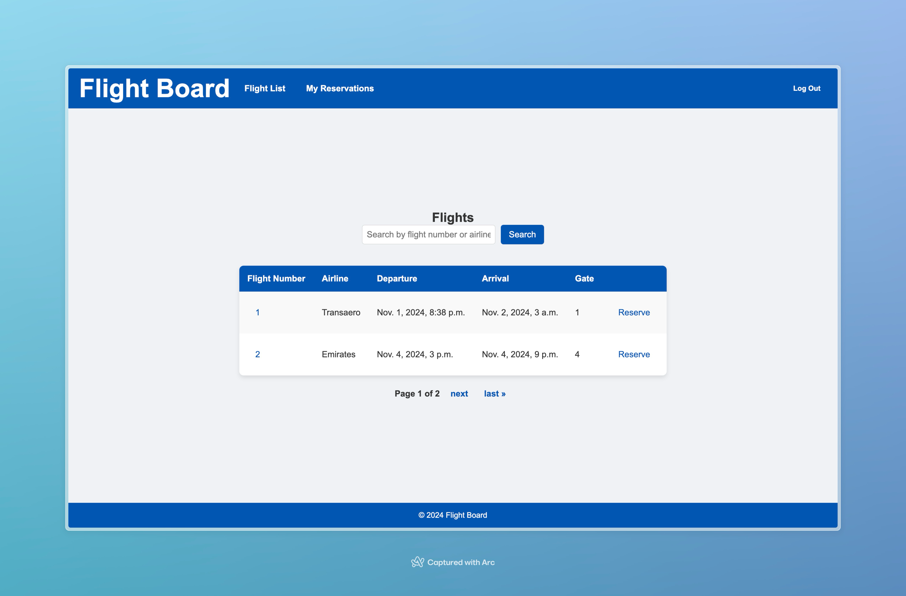
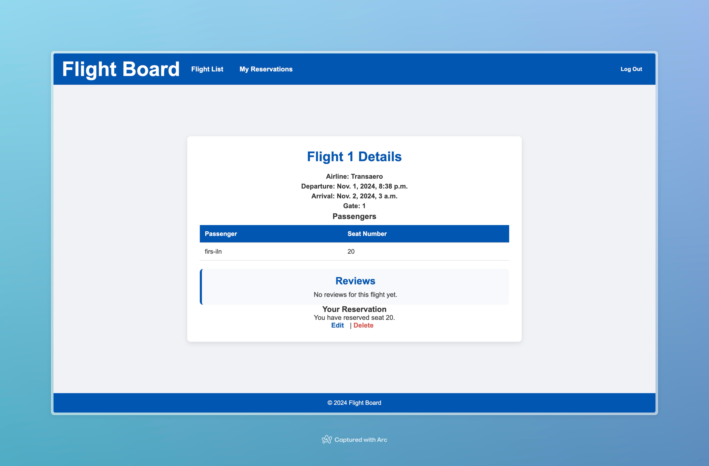

# Flights Board

## Обзор
**Flights Board** — это Django-приложение, предоставляющее платформу для просмотра информации о рейсах, бронирования мест, управления бронированиями и добавления отзывов о рейсах. В приложении реализована регистрация пользователей и административная панель для управления рейсами.

## Задание:

Реализовать веб сервис, в соответствии с вариантом из задания

`Вариант 3: Табло отображения информации об авиаперелетах`

Хранится информация о номере рейса, авиакомпании, отлете, прилете, типе
(прилет, отлет), номере гейта.
Необходимо реализовать следующий функционал:
- Регистрация новых пользователей.
- Просмотр и резервирование мест на рейсах. Пользователь должен иметь
возможность редактирования и удаления своих резервирований.
- Администратор должен иметь возможность зарегистрировать на рейс
пассажира и вписать в систему номер его билета средствами Django-admin.
- В клиентской части должна формироваться таблица, отображающая всех
пассажиров рейса.
- Написание отзывов к рейсам. При добавлении комментариев, должны
сохраняться дата рейса, текст комментария, рейтинг (1-10), информация о
комментаторе.

Дополнительные задания:
- Реализовать меню 
- Реализвать пагинацию страниц 
- Внедрить поиск по объектам, с которыми настроена пагинация

## Содержание
- [Установка](#установка)
- [Модели](#модели)
- [Аутентификация пользователей](#аутентификация-пользователей)
- [Управление рейсами](#управление-рейсами)
- [Управление бронированиями](#управление-бронированиями)
- [Отзывы о рейсах](#отзывы-о-рейсах)
- [Поиск и пагинация](#поиск-и-пагинация)
- [Дополнительные задания](#дополнительные-задания)

---

## Установка
1. **Клонирование репозитория**
   ```bash
   git clone <repository-url>
   cd flights_board
   ```

2. **Установка зависимостей**
   ```bash
   pip install -r requirements.txt
   ```

3. **Настройка базы данных**
   В файле `settings.py` настройте базу данных PostgreSQL:
   ```python
   DATABASES = {
       'default': {
           'ENGINE': 'django.db.backends.postgresql',
           'NAME': 'postgres',
           'USER': 'postgres',
           'PASSWORD': 'postgres',
           'HOST': 'localhost',
           'PORT': '5431',
       }
   }
   ```

4. **Применение миграций**
   ```bash
   python manage.py migrate
   ```

5. **Запуск сервера разработки**
   ```bash
   python manage.py runserver
   ```

---

## Модели

Основные модели проекта находятся в `flights_board/flights/models.py`:

- **Flight** (Рейс): Хранит информацию о рейсе, включая номер, авиакомпанию, время вылета и прилета, номер гейта.
- **Reservation** (Бронирование): Связывает пользователей с конкретными рейсами, указывая место и номер билета.
- **Review** (Отзыв): Позволяет пользователям оставлять отзыв о рейсе, включая текст, рейтинг и дату.

Пример модели **Flight**:
```python
class Flight(models.Model):
    flight_number = models.CharField(max_length=10)
    airline = models.CharField(max_length=50)
    departure = models.DateTimeField()
    arrival = models.DateTimeField()
    gate_number = models.CharField(max_length=5)
```

---

## Аутентификация пользователей

1. **Регистрация**: `/signup/`, использует форму `UserCreationForm`.
2. **Вход/Выход**: `/login/` для входа, POST-запрос по `/logout/` для выхода.

## Управление рейсами

**Список рейсов**  
Главная страница `/` отображает список рейсов с возможностью поиска по номеру или авиакомпании.

**Детали рейса**  
Страница с деталями рейса доступна по адресу `/flight/<flight_id>/`, отображая основную информацию, пассажиров и отзывы.

## Управление бронированиями

1. **Бронирование места** — `/flight/<flight_id>/reserve/` с проверкой занятости места.
2. **Редактирование бронирования** — `/reservation/<reservation_id>/edit/`.
3. **Удаление бронирования** — POST-запрос по `/reservation/<reservation_id>/delete/`.

Пример кода для бронирования места:
```python
@login_required
def reserve_seat(request, flight_id):
    flight = get_object_or_404(Flight, id=flight_id)
    if request.method == 'POST':
        seat_number = request.POST.get('seat_number')
        if Reservation.objects.filter(flight=flight, seat_number=seat_number).exists():
            return render(request, 'reserve_seat.html', {
                'flight': flight,
                'error': "Это место уже занято. Пожалуйста, выберите другое."
            })
        Reservation.objects.create(user=request.user, flight=flight, seat_number=seat_number)
        return redirect('my_reservations')
    return render(request, 'reserve_seat.html', {'flight': flight})
```

## Отзывы о рейсах

Пользователи могут оставлять отзывы для каждого рейса, включая:
- **Рейтинг** (от 1 до 10)
- **Текст комментария**
- **Дата** и **информация о комментаторе**

Форма добавления отзыва:
```python
@login_required
def add_review(request, flight_id):
    flight = get_object_or_404(Flight, id=flight_id)
    if request.method == 'POST':
        rating = request.POST['rating']
        comment_text = request.POST['comment_text']
        Review.objects.create(flight=flight, user=request.user, rating=rating, comment_text=comment_text)
        return redirect('flight_list')
    return render(request, 'add_review.html', {'flight': flight})
```

---

## Поиск и пагинация

В приложении реализованы **поиск** и **пагинация** на страницах списка рейсов и личных бронирований. 

Пример реализации поиска в представлении списка рейсов:
```python
class FlightListView(ListView):
    model = Flight
    template_name = 'flight_list.html'
    paginate_by = 2

    def get_queryset(self):
        query = self.request.GET.get('q')
        queryset = Flight.objects.all()
        if query:
            queryset = queryset.filter(
                flight_number__icontains=query
            ) | queryset.filter(
                airline__icontains=query
            )
        return queryset
```

---

## Дополнительные задания

### Меню
На каждой странице отображается навигационное меню с ссылками на список рейсов, регистрацию, вход/выход и личные бронирования пользователя.

Пример меню в шаблоне `base.html`:
```html
<nav class="main-nav">
    <ul class="navbar-left">
        <li><a href="">Список рейсов</a></li>
        
            <li><a href="">Мои бронирования</a></li>
        
    </ul>
    <ul class="navbar-right">
        
            <li>
                <form action="" method="post" class="logout-form">
                    
                    <button type="submit" class="logout-button">Выйти</button>
                </form>
            </li>
        
            <li><a href="">Регистрация</a></li>
            <li><a href="">Войти</a></li>
        
    </ul>
</nav>
```

### Пагинация страниц
Пагинация реализована в представлениях списков рейсов и бронирований для удобной навигации.

Пример шаблона пагинации:
```html
<div class="pagination">
    <span class="step-links">
        
            <a href="?page=1">&laquo; Первая</a>
            <a href="?page={{ page_obj.previous_page_number }}">Назад</a>
        
        <span class="current">
            Страница {{ page_obj.number }} из {{ page_obj.paginator.num_pages }}
        </span>
        
            <a href="?page={{ page_obj.next_page_number }}">Вперед</a>
            <a href="?page={{ page_obj.paginator.num_pages }}">Последняя &raquo;</a>
        
    </span>
</div>
```

### Поиск по объектам с пагинацией
На странице бронирований реализован поиск по полям рейса и авиакомпании с учетом пагинации.

Пример:
```python
class MyReservationsView(LoginRequiredMixin, ListView):
    model = Reservation
    template_name = 'my_reservations.html'
    paginate_by = 10

    def get_queryset(self):
        queryset = Reservation.objects.filter(user=self.request.user).order_by('-created_at')
        query = self.request.GET.get('q')
        if query:
            queryset = queryset.filter(
                flight__flight_number__icontains=query
            ) | queryset.filter(
                flight__airline__icontains=query
            )
        return queryset
```
