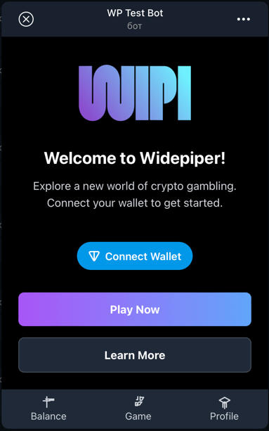
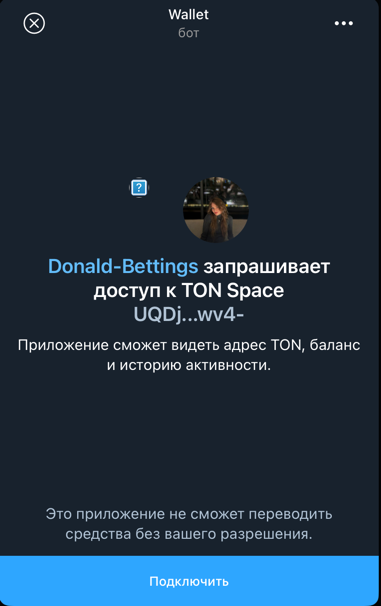
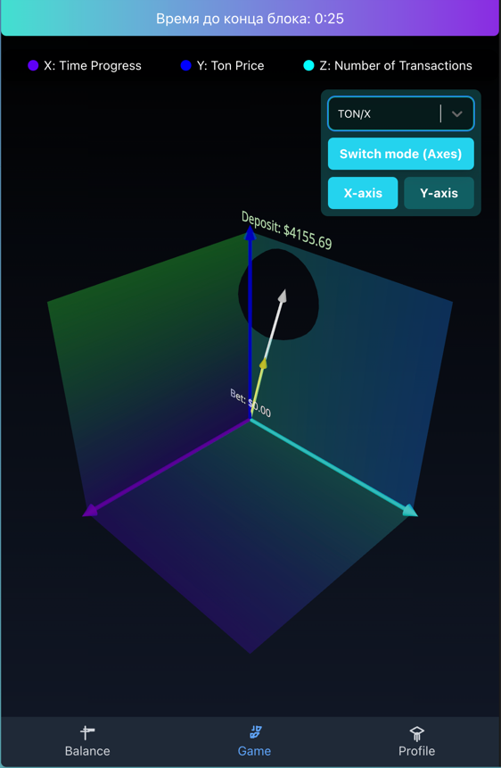
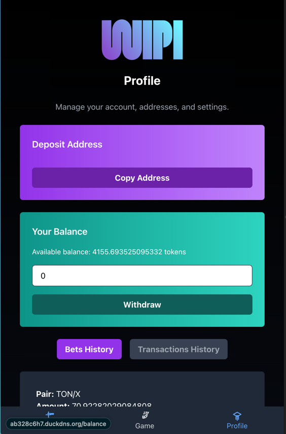
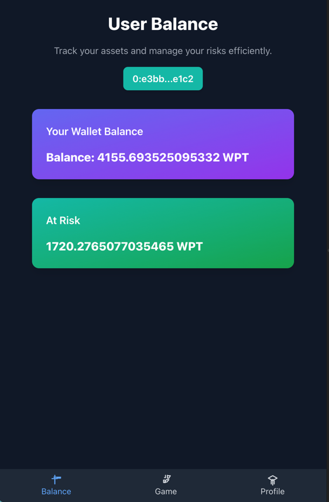
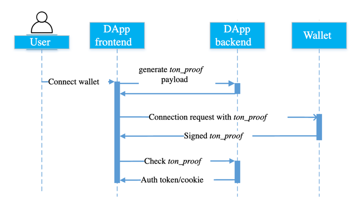

# Лабораторная работа №4: Разработка интерфейсов и интеграция с серверной частью

## Задача проекта

Разработать клиентские интерфейсы для работы с платформой предсказательного беттинга на базе блокчейна, настроить их взаимодействие с серверной частью.

## Используемые библиотеки и их назначение

### Для бэкенда:

- `FastAPI`: Обработка серверной логики, включая аутентификацию пользователей и API.
- `SQLAlchemy`: Работа с базой данных.
- `pytoniq`: Взаимодействие с блокчейном TON, включая вызовы смарт-контрактов.
- `Pydantic`: Определение и валидация входных данных.

## Описание страниц интерфейса

### Главная страница

- **Описание**: Начальная страница, приветствующая пользователей и предоставляющая возможность подключения кошелька.
- **Основные функции**:
  - Приветственное сообщение и описание платформы.
  - Кнопка TonConnect для подключения кошелька.
  - Кнопки "Играть" и "Узнать больше" для навигации.


#### Логика реализации:

- **Подключение кошелька**: Используется `TonConnectButton` для взаимодействия с TonConnect.
- **Предзагрузка данных**: При помощи функций `getPairs()` и `fetchTime()` данные о парах и текущем времени блока загружаются и сохраняются в контексте через `setData`.
- **Обработка ошибок**: Ошибки подключения и загрузки данных отображаются в пользовательском интерфейсе.
- **Переходы**: Кнопки навигации управляют переходом на другие страницы с использованием `useNavigate`.

### Страница ставок

- **Описание**: Предоставляет интерфейс для выбора торговых пар и размещения ставок. При первом открытии пользователю показываются инструкции.
- **Основные функции**:
  - Выбор торговой пары.
  - Ввод предсказания (вектор цены/направления движения).
  - Подтверждение и отправка ставки.

  - на изображении: желтая стрелка - агрегированная ставка всех пользователей за прошлый блок, белая стрелка - ставка юзера за прошлый блок, ее же можно двигать, переключая моды осей, чтобы пояставить новую ставку.
#### Логика реализации:

- **Трёхмерный интерфейс ставок**: Пользователи видят трехмерный график, на котором агрегированные ставки всех участников за прошлый блок и своя ставка в виде стрелок на графике.
- **Обратная связь**: После отправки пользователь получает уведомление о статусе ставки.

### Страница управления кошельком

- **Описание**: Позволяет пользователю управлять балансом кошелька, включая пополнение и вывод средств.
- **Основные функции**:
  - Форма пополнения депозита через TON.
  - Форма вывода средств на кошелек юзера.
  - История транзакций с отображением их статуса.
  - История ставок с отображением их статуса.

#### Логика реализации:

- **Обработка пополнения**: Запросы на сервер для обработки депозитов и их конвертации в токены платформы.
- **Вывод средств**: Инициирование транзакции на указанный адрес (есть возможность сменить адрес).

### Страница балансов юзера

- **Описание**: Позволяет пользователю узнать его оставшийся депозит в игре, а также количество токенов находящихся 'at risk'. 
- **Основные функции**:
  - Отображение балансов юзера.
  - Кнопка для отключения кошелька.

#### Логика реализации:

- **Обработка пополнения**: Запросы на сервер для плучения балансов.
## Реализация авторизации
#### Диаграмма процесса авторизации


### Описание работы

Авторизация на платформе организована через интеграцию с блокчейном Ton и использованием механизма `ton_proof`. Весь процесс проходит несколько ключевых этапов:

1. **Подключение кошелька:**
   - Пользователь подключает кошелёк через интерфейс TonConnect на клиенте.
   - Клиент отправляет запрос на сервер для генерации `payload`.

2. **Подписание proof:**
   - Полученный `payload` подписывается приватным ключом кошелька пользователя.
   - Подписанный proof возвращается на фронтенд, а затем отправляется на сервер для проверки.

3. **Проверка proof:**
   - Сервер валидирует подпись, проверяя её с публичным ключом пользователя в блокчейне.
   - Если proof валиден, сервер генерирует пару токенов (access и refresh) и отправляет их клиенту.

4. **Хранение и использование токенов:**
   - Токены сохраняются в `localStorage` на клиенте и используются для авторизации запросов к API.
   - При истечении срока действия токенов клиент автоматически обновляет их через refresh-токен.


## Основные компоненты бэкенда

### 1. Аутентификация и работа с `ton_proof`

#### **Генерация Payload**
```python
@router.get('/payload')
async def generate_payload():
    tonproof_service = get_tonproof_service()
    payload = await tonproof_service.generate_payload()
    return {"payload": payload}
```

**Объяснение логики:**
- Генерируется уникальный токен (`payload`) с ограниченным временем жизни (TTL), который используется для подписи клиентом.
- Взаимодействие осуществляется через сервис `TonProofService`.

#### **Проверка подписанного Proof**
```python
@router.post('/verify_payload')
async def verify_payload(credentials: Credentials):
    auth_service = get_auth_service()
    tokens = await auth_service.create_token(credentials)
    return {
        "accessToken": tokens.access_token,
        "refreshToken": tokens.refresh_token
    }
```

**Логика:**
- Принимается `ton_proof`, подписанный пользователем.
- Проверяется достоверность подписи и её соответствие публичному ключу кошелька.
- При успешной проверке генерируются `access` и `refresh` токены для последующей работы клиента.

---

### 2. Middleware для проверки авторизации
```python
async def check_for_auth(request: Request, call_next):
    if request.url.path.startswith(('/auth', '/docs', '/openapi')) or request.method == 'OPTIONS':
        return await call_next(request)

    if 'Authorization' not in request.headers:
        return JSONResponse(status_code=401, content={'detail': 'Token is empty'})

    access_token = request.headers['Authorization'].replace('Bearer ', '')
    auth_service = get_auth_service()

    try:
        user_id = await auth_service.get_user_id_from_jwt(access_token)
    except InvalidTokenException:
        return JSONResponse(status_code=401, content={'detail': 'Token is invalid'})
    except ExpiredTokenException:
        return JSONResponse(status_code=401, content={'detail': 'Token is expired'})

    request.scope['x_user_id'] = user_id
    return await call_next(request)
```

**Назначение:**
- Проверяет наличие и валидность токена.
- Извлекает `user_id` из токена и добавляет его в `scope` запроса для использования в хендлерах.

---

### 3. Реализация `TonProofService`

#### Основные методы:

1. **`generate_payload`**: Создаёт временный токен для подписи.
2. **`check_payload`**:
   - Проверяет соответствие домена (`allowed_domains`).
   - Удостоверяется, что срок действия токена не истёк.
   - Проверяет подпись через `PyNaCl`.

#### **Пример валидации подписи**
```python
signature = base64.b64decode(request_raw.proof.signature)
public_key_bytes = bytes.fromhex(request_raw.public_key)
verify_key = VerifyKey(public_key_bytes)

try:
    verify_key.verify(msg_hash, signature)
    return VerifyResult.VALID
except BadSignatureError:
    return VerifyResult.HASH_MISMATCH
```

**Объяснение:**
- Подпись проверяется с использованием публичного ключа пользователя.
- Если подпись недействительна, возвращается ошибка `HASH_MISMATCH`.

---

### 4. Сервис работы с токенами (`TokenService`)

#### Генерация токенов
```python
def create_auth_token(self, wallet_address: str, payload: str) -> AuthTokens:
    access_claims = {"sub": wallet_address, "payload": payload, "exp": datetime.now(tz=UTC) + timedelta(seconds=600)}
    refresh_claims = {"sub": wallet_address, "payload": payload, "exp": datetime.now(tz=UTC) + timedelta(days=1)}
    return AuthTokens(access_token=self.create_token(**access_claims), refresh_token=self.create_token(**refresh_claims))
```

**Логика:**
- Генерирует два токена:
  - **`access_token`**: Используется для авторизации пользователя.
  - **`refresh_token`**: Позволяет обновить `access_token`, если он истёк.

#### Проверка токена
```python
def get_token_payload(self, token: str) -> dict:
    try:
        return decode(token, self.jwt_settings.secret_key, algorithms=["HS256"], issuer=self.jwt_settings.issuer)
    except ExpiredSignatureJWTError:
        raise ExpiredTokenException
    except InvalidTokenJWTError:
        raise InvalidTokenException
```

**Объяснение:**
- Расшифровывает токен и проверяет его действительность.
- Возвращает данные, если токен валиден, или выбрасывает исключение в случае истечения срока или недействительности.

---

### 5. Работа с базой данных через SQLAlchemy

#### Пример модели пользователя
```python
class User(Base):
    __tablename__ = "users"

    id = Column(UUID(as_uuid=True), primary_key=True, default=uuid4)
    wallet_address = Column(String, unique=True, nullable=False)
    username = Column(String, nullable=True)
    balance = Column(Float, default=0.0)
```

**Логика:**
- Таблица `users` хранит информацию о кошельке, имени пользователя и балансе.

#### Пример метода репозитория для запроса к базе
```python
async def get_user_by_wallet(self, wallet_address: str) -> User:
    async with self.sessionmaker() as session:
        res = await session.execute(select(User).where(User.wallet_address == wallet_address))
        res = res.scalars().one()
    return self.entity_to_model(res)
```

**Объяснение:**
- Получает пользователя по адресу кошелька, используя синтаксис SQLAlchemy.

---

## Интеграция с блокчейном

#### Взаимодействие с Web3.py
- **Отправка транзакций:** Используется для обработки операций депозита и вывода.
- **Чтение данных:** Получает информацию о статусе кошелька или блоке.

#### Пример отправки транзакции
```python
    async def send_jettons(
            self,
            user_wallet_address: Address,
            amount: int,
            token_address: Address,
            app_wallet: AppWalletWithPrivateData,
    ) -> None:
        await self.ton.start_up()

        logger.debug('Preparing sending jettons')

        match app_wallet.wallet_version:
            case AppWalletVersion.V4R2:
                wallet_cls = WalletV4R2
            case AppWalletVersion.V5R1:
                raise UnsupportedWalletVersionException(
                    f"Wallet version {app_wallet.wallet_version.value} is not supported"
                )
            case _:
                raise UnsupportedWalletVersionException(
                    f"Wallet version {app_wallet.wallet_version.value} is not supported"
                )

        # Инициализируем кошелек администратора
        wallet = await wallet_cls.from_private_key(
            provider=self.ton,
            private_key=app_wallet.private_key.get_secret_value().encode(),
        )

        source_address = await self.get_wallet_address(
            contract_address=token_address,
            target_address=wallet.address,
        )

        payload = (
            begin_cell()
            .store_uint(0xf8a7ea5, 32)  # op::transfer
            .store_uint(0, 64)  # query_id
            .store_coins(amount)  # jettons to send
            .store_address(user_wallet_address)  # destination jetton wallet owner address
            .store_address()  # response address
            .store_dict()  # custom payload
            .store_coins(0)  # forward ton amount
            .store_maybe_ref()  # forward payload
            .end_cell()
        )

        logger.debug('Wallet initialized for sending tokens')

        # Выполняем вызов контракта с передачей подготовленного payload
        result = await wallet.transfer(
            destination=source_address,
            amount=int(0.01 * 1e9),  # Гарантируем оплату газа
            payload=payload,
        )

        if result > 1:
            raise Exception("Sending jettons failed")

        logger.info(
            f"Sent {amount} tokens "
            f"from {wallet.address.to_str(is_user_friendly=False)} "
            f"to {user_wallet_address.to_str(is_user_friendly=False)}"
        )

        await self.ton.close_all()
```


## Основные компоненты ChainService

### **Сервис ChainService**
ChainService отвечает за управление цепочками блоков, их статусами и процессами, включая генерацию новых блоков, обработку завершённых блоков и контроль транзакций.

---

### 1. **APScheduler и его задачи**

#### **Основные задачи**
- **Генерация новых блоков** (`block_generation`):
  Периодически создаёт новые блоки для активных цепочек.
- **Проверка транзакций пользователей** (`transaction_check`):
  Проверяет статусы транзакций и обновляет данные пользователя.

#### **Настройка планировщика**
```python
def _add_generation_job(self):
    self.scheduler.add_job(
        self._generate_new_blocks,
        trigger=DateTrigger(run_date=datetime.now() + timedelta(seconds=self.block_generation_interval.seconds)),
        id="block_generation",
        replace_existing=True,
        misfire_grace_time=None,
    )
```

**Объяснение:**
- Используется `DateTrigger` для запуска задачи через определённый интервал времени.
- Если задача уже существует, её поведение обновляется (`replace_existing=True`).

```python
def _add_transaction_check_job(self):
    self.scheduler.add_job(
        self.deposit_service.check_users_transactions,
        trigger=IntervalTrigger(seconds=self.transaction_check_interval.seconds),
        id="transaction_check",
        replace_existing=True,
    )
```

**Объяснение:**
- Используется `IntervalTrigger` для периодической проверки транзакций с фиксированным интервалом.

#### **Инициализация планировщика**
```python
async def start_block_generation(self):
    await self._start_chains()
    self.scheduler.start()
    self._add_generation_job()
    self._add_transaction_check_job()
    self.logger.info("Сервис генерации блоков запущен.")
```

**Объяснение:**
- Планировщик задач запускается с добавлением двух основных задач:
  - Генерация блоков.
  - Проверка транзакций.

---

### 2. **Генерация и обработка блоков**

#### **Генерация новых блоков**
```python
async def _generate_new_blocks(self):
    try:
        chains = await self.chain_repository.get_all()
        for chain in chains:
            if chain.status == ChainStatus.PAUSED:
                continue

            last_block = await self.block_service.get_last_block(chain.id)

            if last_block:
                elapsed_time = (datetime.now() - last_block.created_at).seconds + 1
                if (elapsed_time >= self.block_generation_interval.total_seconds()
                        and last_block.status == BlockStatus.IN_PROGRESS):
                    try:
                        rewards = await self._process_completed_block(last_block)
                    except StopPairProcessingException:
                        await self._pause_chain(chain)
                        continue

            new_block = await self.block_service.start_new_block(chain.id)
            if last_block:
                await self.block_service.process_completed_block(
                    block=last_block,
                    new_block_id=new_block.id,
                    rewards=rewards,
                )
            update_chain = UpdateChainDTO(
                current_block=new_block.block_number
            )
            await self.chain_repository.update(chain.id, update_chain)
    except Exception as e:
        self.logger.error("Ошибка генерации блоков", exc_info=True)
        raise e
```

**Объяснение:**
- Для каждой активной цепочки проверяется статус последнего блока.
- Если блок завершён, обрабатывается с распределением наград.
- Создаётся новый блок, а данные цепочки обновляются в базе.

---

### 3. **Проверка транзакций**

```python
def _add_transaction_check_job(self):
    self.scheduler.add_job(
        self.deposit_service.check_users_transactions,
        trigger=IntervalTrigger(seconds=self.transaction_check_interval.seconds),
        id="transaction_check",
        replace_existing=True,
    )
```

**Объяснение:**
- Задача `check_users_transactions` проверяет статусы транзакций пользователей и обновляет их балансы.

---

### 4. **Обработка завершённого блока**

```python
async def _process_completed_block(self, block: Block) -> Rewards:
    await self.block_service.complete_block(block.id)
    try:
        result = await self.orchestrator_service.process_block(block_id=block.id)
        return result.rewards
    except StopPairProcessingException:
        self.logger.error("Обработка пары остановлена", exc_info=True)
        raise
```

**Объяснение:**
- Завершённый блок обрабатывается, и на основе его данных рассчитываются награды.
- Если блок не может быть обработан (например, из-за ошибки пары), обработка цепочки приостанавливается.

---

### 5. **Управление статусами цепочек**

#### **Пауза цепочки**
```python
async def _pause_chain(self, chain: Chain) -> None:
    await self._stop_chain(chain)
    dto = UpdateChainDTO(status=ChainStatus.PAUSED)
    await self.chain_repository.update(chain.id, dto)
```

**Объяснение:**
- Цепочка переводится в статус `PAUSED`, чтобы избежать создания новых блоков.

#### **Остановка цепочки**
```python
async def _stop_chain(self, chain: Chain):
    current_block = await self.block_service.get_last_block(chain.id)
    await self.block_service.handle_interrupted_block(current_block.id)
```

**Объяснение:**
- Если текущий блок в цепочке не завершён, он помечается как прерванный.

---

### 6. **Получение текущего состояния блока**

```python
async def get_current_block_state(self, pair_id: UUID) -> BlockStateResponse:
    try:
        last_block = await self.block_service.get_last_block_by_pair_id(pair_id)
        elapsed_time = (datetime.now() - last_block.created_at).total_seconds()
        remaining_time = max(0.0, self.block_generation_interval.total_seconds() - elapsed_time)

        return BlockStateResponse(
            block_id=last_block.id,
            server_time=str(datetime.now()),
            current_block=last_block.block_number,
            remaining_time_in_block=int(remaining_time),
        )
    except NotFoundException:
        raise
```

**Объяснение:**
- Рассчитывает оставшееся время до завершения текущего блока.
- Возвращает данные для отображения на фронтенде.

